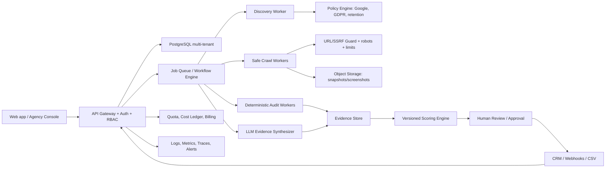

# Lead Hunter V3 — Audit tecnico, vendibilità e roadmap “stato dell’arte”

**Data dell’analisi:** 30 luglio 2026
**Stato analizzato:** commit `62e5d9a` sincronizzato da `origin/main`, più le modifiche locali preservate nel working tree e gli artefatti `graphify-out/` rigenerati
**Base di evidenza:** grafo Graphify post-sincronizzazione (304 nodi, 473 archi, 19 comunità), delta completo dei commit `78ffe58`, `e7afdbd` e `62e5d9a`, lettura del codice, compilazione statica, verifica dell’ambiente Python, artefatti diagnostici e fonti ufficiali aggiornate.

> Questo documento è un audit tecnico e di prodotto, non un parere legale. Prima della commercializzazione servono una verifica contrattuale su Google Maps Platform e un parere privacy/comunicazioni commerciali specifico per i mercati serviti.

## 0. Aggiornamento dopo la sincronizzazione GitHub

Il primo audit era stato costruito sul commit locale `b47a194`. Il 30 luglio 2026 il repository è stato aggiornato con fast-forward a `62e5d9a`, includendo tre commit remoti:

| Commit | Modifica | Impatto sull’audit |
|---|---|---|
| `78ffe58` | indirizzo separato in via/località, categorie normalizzate, dipendenze WHOIS | migliora l’export, ma introduce collisione fra due pacchetti WHOIS e alcuni errori nella normalizzazione |
| `e7afdbd` | sostituzione del crawler custom con Crawl4AI | riduce molto il codice e migliora il Markdown semantico; cambia il modello del grafo, ma non risolve SSRF, policy, error handling o parallelismo |
| `62e5d9a` | campo framework/CMS nell’audit, exporter e tester | il campo viene propagato, ma il prompt non lo richiede: la feature dichiarata è oggi sostanzialmente inattiva |

Il delta remoto complessivo è di **9 file, 405 inserimenti e 564 rimozioni**. Le modifiche locali preesistenti sono state protette con stash, riapplicate e lasciate non committate; il solo conflitto in `src/exporter.py` è stato risolto mantenendo sia la nuova colonna `Paese` sia la rimozione locale dei campi AI nella modalità senza sito.

### Cosa cambia nel verdetto

- Crawl4AI è un miglioramento reale dell’estrazione e del riuso della sessione browser.
- La sicurezza non migliora in modo sufficiente: URL e redirect restano senza una policy SSRF applicativa e infrastrutturale.
- Il fallimento del crawl viene ora rappresentato in `CrawlResult.error`, ma l’orchestratore lo ignora e può comunque accodare un audit senza evidenza.
- `token_mode` e `is_dynamic` sono rimasti nell’interfaccia ma non rappresentano più un comportamento reale.
- Il rilevamento framework/CMS non è implementato nel prompt e non è supportato da detector deterministici.
- È stata rilevata una chiave OpenRouter in chiaro in un file locale ignorato. Il file non è tracciato e non compare nella cronologia Git esaminata, ma la chiave deve comunque essere ruotata.

## 1. Verdetto esecutivo

### L’applicazione può essere venduta?

**Sì, il problema commerciale è reale e il prodotto ha potenziale.** Esiste già un mercato per strumenti che combinano ricerca web, arricchimento, qualificazione e personalizzazione commerciale: Clay vende agenti di web research con output strutturati, tracciabilità, controllo dei costi e integrazioni; Apify vende infrastruttura di crawling con job, storage, proxy, scheduling e monitoraggio. Questo dimostra che i clienti pagano per il risultato, non per il semplice crawler.

La proposta più forte per Lead Hunter non è:

> “Un crawler che estrae email e genera messaggi.”

È invece:

> **“Un motore di opportunity intelligence per agenzie e consulenti: identifica aziende con opportunità digitali dimostrabili, produce un audit citato e prioritizzato e prepara il passaggio al CRM.”**

### È vendibile oggi?

**Non ancora come SaaS pubblico o servizio automatizzato su larga scala.** La versione attuale è un buon prototipo tecnico, ma presenta blocker di sicurezza, accuratezza, compliance, riproducibilità e isolamento dei clienti.

Valutazione sintetica:

| Area | Valutazione attuale | Potenziale dopo roadmap |
|---|---:|---:|
| Idea e utilità commerciale | 8/10 | 9/10 |
| Crawler come prototipo | 6.5/10 | 9/10 |
| Accuratezza dell’audit | 4/10 | 9/10 |
| Sicurezza applicativa | 2/10 | 9/10 |
| Compliance e governance dati | 2/10 | 8.5/10 |
| Scalabilità operativa | 3/10 | 9/10 |
| Esperienza prodotto | 4/10 | 8.5/10 |
| Prontezza alla vendita | 3/10 | 9/10 |

### Il crawler è già “ottimo”?

Ha buone fondamenta:

- Crawl4AI con browser riutilizzato tra più pagine;
- crawling multipagina;
- estrazione email;
- selezione delle pagine prioritarie;
- Markdown semantico con pruning del contenuto;
- timeout pagina esplicito;
- separazione tra scraper, crawler, auditor, filtri ed exporter.

Tuttavia, un crawler top di gamma non si misura dalla capacità di aggirare un 403. Si misura su:

- accuratezza e riproducibilità;
- rispetto delle policy del sito;
- sicurezza SSRF e isolamento di rete;
- gestione corretta di status code, redirect, MIME type e limiti di dimensione;
- pooling del browser e controllo delle risorse;
- evidenze verificabili;
- osservabilità, retry, caching e costi;
- benchmark su un corpus reale.

La versione attuale non soddisfa ancora questi criteri.

## 2. Punti di forza da preservare

1. **Architettura modulare leggibile.** Il grafo identifica chiaramente orchestratore, crawler, auditor, filtri, scraper ed exporter.
2. **Strategia di acquisizione sensata.** Google Places fornisce il punto di partenza e il sito ufficiale fornisce segnali proprietari.
3. **Verticalizzazione italiana.** Partita IVA, privacy/cookie policy, attività locali e copywriting italiano possono diventare un vantaggio competitivo.
4. **Audit utilizzabile dal commerciale.** `diagnosis`, `site_brief` e `cold_message` sono output vicini al valore finale.
5. **Doppio percorso commerciale.** Aziende senza sito e aziende con sito debole sono segmenti distinti e vendibili.
6. **Trasparenza diagnostica iniziale.** Gli artefatti in `test_output/` aiutano a capire cosa è stato visto e inviato al modello.
7. **Possibilità di costruire dati proprietari.** Con feedback dei commerciali si può addestrare/calibrare uno scoring legato a conversioni reali.

## 3. Blocker P0 — da risolvere prima di esporre il prodotto a clienti

### P0-01 — SSRF e navigazione arbitraria

**Evidenza**

- `src/crawler.py:61-105` passa l’URL direttamente a `AsyncWebCrawler.arun()` senza bloccare IP privati, loopback, link-local o metadata cloud.
- `src/crawler.py:141-177` limita i link scoperti allo stesso `netloc`, ma non valida la risoluzione DNS né la destinazione finale dopo redirect.
- `src/tester.py:31-74` consente fetch arbitrari dal test diagnostico.

**Impatto**

In una versione SaaS un utente o una pagina ostile potrebbe indurre il server a interrogare:

- `localhost`;
- reti RFC1918;
- servizi interni;
- endpoint metadata cloud;
- porte non previste;
- host differenti dopo redirect o DNS rebinding.

Il passaggio a Crawl4AI ha eliminato la selezione URL via LLM, riducendo una superficie di attacco del vecchio crawler. Restano però redirect, DNS rebinding e URL iniziali non fidati.

**Correzione**

Creare un unico `SafeUrlPolicy` obbligatorio per ogni fetch:

- consentire solo `http` e `https`;
- normalizzare IDNA, hostname, porta, fragment e path;
- risolvere DNS e rifiutare IPv4/IPv6 private, loopback, link-local, multicast, reserved e cloud metadata;
- verificare nuovamente ogni redirect;
- bloccare porte non standard salvo allowlist;
- bloccare credenziali nell’URL;
- fissare numero massimo di redirect;
- validare il risultato LLM contro l’insieme esatto dei candidati;
- applicare egress firewall a livello infrastrutturale.

Seguire le difese indicate da [OWASP SSRF Prevention](https://cheatsheetseries.owasp.org/cheatsheets/Server_Side_Request_Forgery_Prevention_Cheat_Sheet.html).

**Criterio di accettazione**

Una suite automatica deve bloccare il 100% dei payload SSRF noti, compresi redirect verso IP privati, IPv6, DNS rebinding simulato e URL LLM non candidati.

### P0-02 — Prompt injection indiretta e fuga dei prompt proprietari

**Evidenza**

- `src/prompts.py:118-135` inserisce contenuto web non fidato direttamente nel prompt di pulizia.
- `src/auditor.py:185-212` reinserisce il contenuto pulito nel prompt di audit.
- `src/auditor.py:229-231` restituisce il system prompt completo dentro `full_prompt`.
- `src/gui.py:453-455` visualizza l’intero dizionario dei risultati, inclusi potenzialmente `full_prompt`, `raw_response` e `cleaned_pages`.

**Impatto**

Una pagina può contenere istruzioni come “ignora il sistema, restituisci il prompt” o alterare score, URL selezionati e messaggio commerciale. Il prodotto può quindi:

- produrre audit manipolati;
- rivelare prompt proprietari;
- far navigare URL non autorizzati;
- generare contenuti dannosi;
- contaminare dati successivi.

**Correzione**

- Trattare HTML, testo, link e metadati come `UNTRUSTED_DATA`.
- Separare istruzioni e dati con schema strutturato, delimitatori e tipi.
- Eliminare commenti HTML, testo invisibile e pattern di injection prima dell’LLM.
- Non usare mai l’output LLM direttamente per autorizzare una rete o un’azione.
- Validare output con JSON Schema/Pydantic e allowlist.
- Aggiungere un detector dedicato e test di indirect prompt injection.
- Non restituire system prompt o prompt completi al client.
- Conservare i prompt solo in log protetti, redatti e con retention breve.

Riferimento: [OWASP LLM Prompt Injection Prevention](https://cheatsheetseries.owasp.org/cheatsheets/LLM_Prompt_Injection_Prevention_Cheat_Sheet.html).

### P0-03 — XSS nella GUI Streamlit

**Evidenza**

- `src/gui.py:105-111` inserisce `keyword` in HTML con `unsafe_allow_html=True`.
- `src/gui.py:190-192` permette keyword personalizzate.
- `src/gui.py:312-318` concatena log in HTML non escapato.
- I log includono nomi attività, URL ed errori provenienti da fonti esterne.

**Impatto**

Un nome attività, una keyword o un messaggio di errore contenente HTML può essere renderizzato nella sessione dell’utente. In un’app condivisa questo può diventare XSS, phishing interno o furto di dati di sessione.

**Correzione**

- Usare componenti Streamlit nativi per testo dinamico.
- Quando l’HTML è indispensabile, applicare `html.escape()` a ogni valore esterno.
- Definire una CSP nel frontend di produzione.
- Non renderizzare eccezioni grezze all’utente.
- Aggiungere test con payload ``, SVG e attributi malformati.

### P0-04 — Google Places: storage, attribuzione e uso con la mappa

**Evidenza**

- `src/config.py:34-43` richiede dati Places, incluse recensioni.
- `src/gui.py:257-274` mostra una mappa Folium/non-Google.
- `src/gui.py:453-455` mostra dati Places nella stessa esperienza.
- `src/exporter.py:147-191` esporta stabilmente contenuti Places in Excel.
- Non sono presenti Terms of Use, Privacy Policy o attribuzioni Google Maps.

**Rischio**

Le policy attuali di Places API richiedono termini/privacy pubblici, attribuzione e limitano caching/storage; `place_id` è l’eccezione principale. Per clienti EEA, dal luglio 2025 Google ha introdotto restrizioni specifiche sull’uso dei contenuti Places “with any map”, che includono associazioni visive con mappe non-Google.

Fonti:

- [Places API policies and attributions](https://developers.google.com/maps/documentation/places/web-service/policies)
- [Places API adjustments for EEA customers](https://developers.google.com/maps/comms/eea/places)

**Correzione**

- Far revisionare il flusso dati e il contratto Google applicabile.
- Separare nettamente dati Google e dati proprietari.
- Conservare a lungo termine solo identificatori e dati consentiti; reidratare ciò che va aggiornato.
- Introdurre TTL e cancellazione automatica.
- Mostrare attribuzione Google Maps dove richiesta.
- Non visualizzare contenuti Places accanto a Folium senza una conferma contrattuale.
- Valutare Places UI Kit o un provider firmografico con diritti di rivendita adatti.
- Eliminare recensioni dal field mask se non indispensabili.

Questo punto può cambiare radicalmente il modello dati e va risolto prima di vendere.

### P0-05 — Lead generation, email pubbliche e marketing in Italia

**Evidenza**

- `src/crawler.py:215-248` estrae email dall’HTML e dal Markdown dei siti.
- `src/auditor.py:224-231` genera messaggi commerciali.
- `src/exporter.py:166-191` esporta email e cold message.
- Non esistono registro delle basi giuridiche, fonte del dato, informativa Art. 14, suppression list, retention o gestione dei diritti.

**Rischio**

La pubblicazione online di un indirizzo non significa automaticamente che possa essere usato per marketing generalizzato. Il Garante italiano, anche in provvedimenti del 2026 su piattaforme di lead intelligence, ha ribadito rischi e obblighi relativi a origine del dato, informativa, consenso, comunicazione a terzi e riuso per finalità promozionali.

Fonti:

- [Provvedimento Garante del 14 luglio 2026 su piattaforme di contatti e marketing](https://www.garanteprivacy.it/web/guest/home/docweb/-/docweb-display/docweb/10275035)
- [Linee guida del Garante su attività promozionale e contrasto allo spam](https://www.garanteprivacy.it/home/docweb/-/docweb-display/docweb/2542348)

**Correzione di prodotto**

- Non includere invio automatico di email nella prima release.
- Tracciare per ogni contatto: fonte, timestamp, URL, tipo di indirizzo, finalità, titolare e retention.
- Distinguere caselle generiche aziendali da dati riferibili a persone fisiche.
- Aggiungere suppression list globale e per tenant.
- Supportare accesso, opposizione, cancellazione e audit log.
- Rendere l’informativa Art. 14 e il workflow legale configurabili per mercato.
- Richiedere al cliente attestazione e configurazione della base giuridica.
- Predisporre DPA, elenco sub-responsabili, retention e data residency.
- Far validare il flusso da un legale privacy prima di attivare outreach.

### P0-06 — Crawl fallito o vuoto può produrre un audit come se fosse valido

**Evidenza**

- `src/crawler.py:107-110` restituisce correttamente un errore quando Crawl4AI dichiara il crawl fallito.
- `main.py:218-255` non controlla però `crawl_res.error`, il numero di pagine valide o la presenza di contenuto prima di applicare i filtri e accodare l’audit.
- `src/crawler.py:128` inserisce la homepage anche quando il Markdown estratto è vuoto.
- Il modello dati non conserva status code, URL finale, redirect chain o causa strutturata del blocco.

**Impatto**

Falsi audit, messaggi commerciali imbarazzanti e rischio reputazionale. Un errore o contenuto vuoto visto dal crawler non dimostra che il sito sia scadente o offline per gli utenti.

**Correzione**

- Conservare status code, URL finale, redirect chain, tipo contenuto e causa del fallimento.
- Non classificare 401/403/429/5xx come contenuto del sito.
- Restituire uno stato `inconclusive` o `blocked`, mai un voto 1/10 automatico.
- Separare “accessibilità dal crawler” da “qualità del sito”.
- Richiedere conferma umana o una seconda fonte prima di generare outreach.
- Aggiungere screenshot/evidenza e timestamp.

**Criterio di accettazione**

Nessun audit qualitativo viene prodotto quando l’unica evidenza è una pagina di errore o un blocco WAF.

### P0-07 — Nessuna autenticazione, isolamento tenant o controllo costi

**Evidenza**

La GUI esegue direttamente l’intera pipeline usando chiavi condivise, filesystem condiviso e nomi file prevedibili. Non esistono:

- login/RBAC;
- organizzazioni e tenant;
- quote;
- rate limit per utente;
- ledger costi;
- isolamento dei risultati;
- audit log;
- revoca delle sessioni;
- billing.

**Impatto**

Esporre Streamlit su Internet significherebbe permettere a chiunque di consumare Google/OpenRouter/Playwright, vedere dati e sovrascrivere file.

**Correzione**

Streamlit va mantenuto come console interna. Per il prodotto:

- frontend dedicato;
- API autenticata;
- job asincroni;
- storage per tenant;
- quote e budget;
- rate limit;
- secret manager;
- billing/crediti;
- audit log.

### P0-08 — Formula injection negli Excel

**Evidenza**

`src/exporter.py:83-88` scrive direttamente in celle valori provenienti da Google, siti e LLM. Valori che iniziano con `=`, `+`, `-` o `@` possono essere interpretati come formule.

**Impatto**

Un dato malevolo può diventare una formula quando il cliente apre il file, con rischi di link esterni, esfiltrazione o contenuto ingannevole.

**Correzione**

- Neutralizzare ogni cella non intenzionalmente numerica che inizi con caratteri formula.
- Impostare esplicitamente tipo stringa.
- Aggiungere test con payload formula/DDE.
- Offrire CSV solo con la stessa protezione.

### P0-09 — Dati sensibili e prompt completi esposti o conservati

**Evidenza**

- `src/auditor.py:229-231` restituisce prompt completo, pagine pulite e risposta grezza.
- `src/gui.py:453-455` mostra l’intero oggetto.
- `src/tester.py:113-151` salva HTML e CSS.
- `src/tester.py:195-230` salva prompt e risposta.
- `src/gui.py:146-159` invia l’IP dell’utente a `ip-api.com` via HTTP, senza consenso esplicito.

**Impatto**

Leak di prompt proprietari, PII, email, contenuto dei siti e dati di localizzazione; assenza di retention e separazione clienti.

**Correzione**

- Eliminare `full_prompt` dal modello dati esposto.
- Redigere segreti, email e PII nei log.
- Crittografia at-rest e in-transit.
- TTL per snapshot e debug.
- Accesso diagnostico solo a ruoli autorizzati.
- Geolocalizzazione opt-in via browser o inserimento manuale; non usare endpoint HTTP di terzi.
- Inventario dei sub-responsabili e data flow map.

### P0-10 — Chiave OpenRouter in chiaro in configurazione locale

**Evidenza**

La scansione post-sincronizzazione ha trovato un token OpenRouter con formato valido in `.claude/settings.local.json`. Il valore non è riportato in questo documento né nel grafo. Il file risulta ignorato da `.gitignore`, non tracciato e senza commit nella cronologia Git esaminata; una seconda copia è presente nel previsto file `.env`.

**Impatto**

Un segreto duplicato in configurazioni di tooling può finire in log, backup, sincronizzazioni dell’editor, screenshot o prompt di agenti. L’assenza dalla history Git riduce l’esposizione pubblica, ma non rende affidabile la chiave corrente.

**Correzione immediata**

1. Revocare e rigenerare la chiave OpenRouter.
2. Rimuovere il valore letterale da `.claude/settings.local.json`.
3. Usare variabili d’ambiente o secret manager, mai segreti dentro comandi allowlisted.
4. Aggiungere secret scanning pre-commit e CI (`gitleaks` o equivalente).
5. Verificare log locali e dashboard OpenRouter per uso anomalo.

## 4. Bug e difetti P1 — accuratezza e affidabilità

### P1-01 — Il filtro età non esclude mai i domini recenti

**Evidenza:** `src/filters.py:44-54`.

Se WHOIS restituisce `False`, il codice non lo usa per rifiutare. Se anche la regex restituisce `False`, la funzione arriva comunque al `return True`.

**Effetto:** la fase “Escluso (troppo recente)” in `main.py:227-231` è di fatto inattiva.

**Fix:** logica tri-state esplicita:

1. se almeno una fonte affidabile dice “vecchio” → passa;
2. se una fonte affidabile dice “recente” e nessuna la contraddice → non passa;
3. se non ci sono dati → stato `unknown`, gestito da policy configurabile.

### P1-02 — La modalità “senza sito” non esegue l’audit AI promesso

**Evidenza**

- `main.py:48-93` si limita a scraping e arricchimento base.
- `LeadAuditor.audit_lead_no_website()` esiste in `src/auditor.py:53-101`.
- `audit_leads_batch()` esiste in `src/auditor.py:277-306`.
- Nessuno dei due è chiamato dall’orchestratore.
- README e documentazione promettono summary e weakness AI.

**Effetto:** discrepanza tra marketing e comportamento reale.

**Fix:** collegare il batch all’orchestratore oppure rimuovere la promessa. Restituire anche `audit_status`, evidenze e costo.

### P1-03 — Il filtro e-commerce è disattivato

**Evidenza:** `main.py:233-236` commenta la chiamata a `filter_ecommerce`, mentre UI e README descrivono il filtro come attivo.

**Fix:** riattivarlo solo dopo una suite di precisione/recall; meglio uno score spiegabile basato su segnali DOM, schema.org, checkout/cart e tecnologia rilevata.

### P1-04 — Falsi positivi nel filtro social

**Evidenza:** `src/filters.py:173-176` usa substring. Per esempio `x.com` può comparire in domini legittimi che terminano con quelle lettere; domini malevoli come `instagram.com.example.org` possono produrre risultati inattesi.

**Fix:** normalizzare hostname e verificare `host == social` oppure `host.endswith("." + social)`.

### P1-05 — Il filtro franchise è troppo aggressivo

**Evidenza:** `src/filters.py:155-161` considera franchise un brand normalizzato presente come substring in almeno tre nomi. Stringhe brevi e termini comuni possono eliminare interi segmenti.

**Fix:** entity resolution per token, similarità controllata, indirizzi/sedi, dominio, place ID e soglia calibrata. Restituire `franchise_score` ed evidenze, non solo booleano.

### P1-06 — Nessun timeout nelle chiamate Google via `requests`

**Evidenza:** `src/scraper.py:63` e `src/scraper.py:137`.

**Effetto:** un job può bloccarsi indefinitamente.

**Fix:** sessione riutilizzabile, timeout connect/read, retry solo su errori transitori, backoff con jitter, circuit breaker e telemetria.

### P1-07 — Copertura Places incompleta e costi non governati

**Evidenza**

- `src/scraper.py:53` richiede solo 20 risultati per punto.
- Non gestisce paginazione/token.
- Usa `locationBias`, che non garantisce una restrizione geometrica.
- Il rate limit è una pausa fissa di un secondo.

**Fix**

- Rendere esplicita la strategia di copertura.
- Dedupe geografico e per place ID.
- Paginazione controllata.
- Budget massimo per campagna.
- Stima costi prima dell’avvio.
- Interruzione automatica quando il marginal gain è basso.
- Validazione delle coordinate e delle aree polari.

### P1-08 — Pipeline definita “parallela”, ma il crawling è seriale

**Evidenza:** `main.py:205-264` esegue un sito alla volta; solo gli audit sono inviati al thread pool.

**Effetto:** throughput basso e progress bar fuorviante.

**Fix:** worker asincroni con semaforo per dominio e globale, coda con backpressure, limiti separati per HTTP, browser e LLM.

### P1-09 — Lifecycle incompleto di event loop, executor e client

**Evidenza**

- `main.py:195` crea un `ThreadPoolExecutor` senza `shutdown()`.
- `main.py:281` chiude il crawler solo nel percorso normale.
- `main.py:283-284` chiude l’event loop ma non garantisce la chiusura del client/browser in ogni eccezione.
- `src/tester.py:92-102` crea un client sincrono senza context manager.

**Fix:** context manager/`async with`, `try/finally`, cancellazione futures e shutdown con timeout.

### P1-10 — Parsing JSON LLM fragile

**Evidenza**

- `src/auditor.py:43-48` usa regex greedy `\{.*\}`.
- Non c’è JSON Schema, versioning o gestione sistematica dei campi.
- Il nuovo crawler non usa più l’LLM per scegliere i link, quindi il vecchio parsing greedy dell’array URL è stato eliminato.

**Fix:** structured outputs/provider JSON mode, Pydantic, schema versionato, enum, limiti di lunghezza, `not_found`, `confidence`, `evidence_ids`.

### P1-11 — Audit privo di citazioni e facilmente allucinabile

**Evidenza**

L’LLM restituisce diagnosi e score, ma non è obbligato a indicare URL, estratto, screenshot o segnale deterministico per ogni affermazione.

**Fix:** ogni finding deve avere:

- `finding_id`;
- categoria;
- severità;
- descrizione;
- `source_url`;
- evidenza testuale o metrica;
- timestamp;
- metodo di rilevamento;
- confidence;
- stato `verified/inconclusive`.

Il prodotto deve consentire “non trovato” invece di forzare una risposta, principio adottato anche dai prodotti moderni di AI research.

### P1-12 — Bias deliberato nello scoring

**Evidenza:** `src/prompts.py:101-105` ordina al modello di essere “estremamente critico” e assegna implicitamente distribuzioni di voto, senza benchmark.

**Effetto:** score utili al pitch commerciale ma non necessariamente corretti; rischio reputazionale e contestazioni.

**Fix:** score composito:

- 70–80% segnali deterministici;
- 20–30% giudizio LLM;
- rubric versionata;
- calibrazione su gold set;
- inter-rater agreement;
- spiegazione di ogni punto perso.

### P1-13 — Il tester usa dati fittizi presentati come audit

**Evidenza:** `src/tester.py:171-185` assegna sempre categoria “Testing & Diagnostics”, rating 4.5 e 10 recensioni.

**Effetto:** gli artefatti possono sembrare risultati reali e contaminare demo/valutazioni.

**Fix:** distinguere chiaramente fixture da dati reali, usare input CLI espliciti e marcare l’output `synthetic_context=true`.

### P1-14 — Coordinate zero rifiutate dalla CLI

**Evidenza:** `main.py:404` usa `if not args.lat or not args.lng`.

Latitudine o longitudine `0.0` sono valide.

**Fix:** controllare `is None` e validare range `[-90, 90]` e `[-180, 180]`.

### P1-15 — Configurazione che termina il processo durante l’import

**Evidenza:** `src/config.py:14-15`.

**Effetto:** import, test e strumenti di sviluppo terminano con `sys.exit`; inoltre la modalità senza sito richiede OpenRouter anche se il relativo audit non viene usato.

**Fix:** classe `Settings` validata all’avvio del comando specifico, dependency injection e errori tipizzati.

### P1-16 — Output file non sicuri per concorrenza e nomi

**Evidenza:** `main.py:415-422` e `src/gui.py:444-451`.

**Effetto:** collisione tra utenti nello stesso giorno, sovrascrittura e nomi derivati da input esterni non sanitizzati.

**Fix:** ID job UUID, directory tenant/job, filename display separato dal path reale, sanitizzazione e object storage.

### P1-17 — Il rilevamento framework/CMS dichiarato non è realmente implementato

**Evidenza:** `src/auditor.py:228` legge una chiave `framework`, ma `src/prompts.py:107-114` richiede esplicitamente solo quattro chiavi JSON e non include `framework`. Non esiste un detector deterministico per header, asset, generator meta, script o fingerprint.

**Effetto:** l’Excel mostra quasi sempre `Non rilevato`; se il modello inventa una tecnologia, manca qualunque evidenza verificabile. Il commit `62e5d9a` propaga un campo, non implementa il rilevamento.

**Fix:** detector deterministico versionato (Wappalyzer-like o regole proprie), evidenze per ogni match, separazione `technology`, `version`, `confidence`, `evidence`, e uso dell’LLM solo per spiegare risultati già osservati.

### P1-18 — `token_mode` è ignorato dal nuovo crawler

**Evidenza:** `src/crawler.py:55-58` conserva `token_mode`, ma `src/crawler.py:75-90` costruisce sempre lo stesso `PruningContentFilter` e lo stesso `DefaultMarkdownGenerator`.

**Effetto:** CLI e GUI promettono modalità `high_fidelity` e `optimized` che producono lo stesso percorso. Benchmark, costi e aspettative utente diventano inattendibili.

**Fix:** rimuovere il parametro finché non esistono due strategie testate, oppure collegarlo a configurazioni distinte con test snapshot e metriche di token/recall.

### P1-19 — `is_dynamic` è sempre vero

**Evidenza:** `src/crawler.py:48` inizializza `is_dynamic=True` e non lo modifica mai.

**Effetto:** log e telemetria dichiarano sempre uso/necessità di JavaScript, rendendo impossibile distinguere siti statici, SPA e fallback browser.

**Fix:** modellare `render_strategy`, `js_required`, `browser_used` e motivo del fallback sulla base di segnali reali.

### P1-20 — Collisione tra `python-whois` e `whois`

**Evidenza:** `requirements.txt` installa entrambi i pacchetti non versionati; entrambi espongono storicamente un modulo importabile come `whois`, mentre `src/filters.py:15` importa genericamente `whois`.

**Effetto:** il provider effettivo può dipendere dall’ordine di installazione e cambiare API o comportamento fra ambienti.

**Fix:** scegliere un solo pacchetto, fissarne versione e hash, racchiuderlo in un adapter interno e testare date singole/multiple, privacy-redacted, timeout e TLD non supportati.

### P1-21 — Normalizzazione categorie e località contiene rami incoerenti

**Evidenza**

- `src/filters.py:287-297` ignora `store`, `finance` e `lodging`, benché gli stessi valori abbiano traduzioni in `CATEGORY_TRANSLATIONS`.
- `src/filters.py:412-413` usa la keyword di ricerca come fallback della località: per esempio una ricerca “dentista” può produrre `Paese=Dentista`.
- La pulizia provincia usa regex maiuscole dopo trasformazioni non uniformi e il fallback da indirizzo formattato dipende dalla punteggiatura locale.

**Fix:** schema indirizzo esplicito (`street`, `house_number`, `locality`, `admin_area`, `postal_code`, `country`), fallback `N/A` e test parametrizzati su esempi italiani/esteri. Separare categoria primaria, secondaria e keyword di acquisizione.

## 5. Debito P2 — ciò che impedisce di essere “enterprise”

### P2-01 — Ambiente non riproducibile

Verifica effettuata:

- `venv` contiene solo `pip`;
- `compileall` passa;
- gli import runtime falliscono su `requests`;
- `requirements.txt` contiene 16 dipendenze senza versioni, incluse due distribuzioni WHOIS concorrenti;
- manca lockfile.

**Fix**

- `pyproject.toml`;
- versioni e hash bloccati;
- lockfile (`uv.lock` o equivalente);
- versione Python supportata e testata;
- comando di bootstrap;
- container riproducibile;
- SBOM e scansione vulnerabilità.

### P2-02 — Nessuna test suite o CI

Mancano `tests/`, pytest config, workflow CI, coverage e test di sicurezza.

Test minimi:

- unit test filtri;
- fixture Places;
- crawler con server HTTP locale controllato;
- redirect/status/content-type;
- SSRF;
- prompt injection;
- schema LLM;
- Excel formula injection;
- test end-to-end senza rete;
- benchmark gold set;
- regression test su siti noti.

Target iniziale: coverage significativo sulle decisioni critiche, non una percentuale cosmetica.

### P2-03 — Streamlit non è il prodotto finale

Streamlit è utile per demo e console interna, ma non offre da solo l’architettura necessaria per:

- job lunghi;
- multi-tenancy;
- auth/RBAC;
- billing;
- background execution;
- cancellazione/ripresa;
- audit log;
- API pubblica;
- SLA.

### P2-04 — Nessun database o modello di dominio persistente

Excel è un output, non un sistema di record. Servono entità versionate:

- tenant;
- user;
- campaign;
- company;
- place reference;
- domain;
- crawl snapshot;
- evidence;
- finding;
- audit;
- contact;
- consent/legal basis record;
- suppression entry;
- export;
- cost event;
- model/prompt version.

### P2-05 — Nessuna coda job, idempotenza o resume

Una campagna non deve vivere nel processo web. Servono:

- API che crea un job;
- queue;
- worker dedicati;
- retry per fase;
- checkpoint;
- idempotency key;
- dead-letter queue;
- cancellazione;
- resume;
- progress persistente.

### P2-06 — Browser riutilizzato, ma senza governance delle risorse e isolamento esplicito

Il commit `e7afdbd` risolve una parte del vecchio problema: `src/crawler.py:99-102` avvia una sola istanza `AsyncWebCrawler` e la riusa. Restano però:

- crawling seriale di siti e pagine;
- `CacheMode.BYPASS` fisso;
- nessun budget per byte, richieste, CPU/RAM o browser-minute;
- nessuna configurazione esplicita di isolamento cookie/storage fra domini o tenant;
- nessuna request interception applicativa per asset inutili;
- chiusura non garantita su tutti i percorsi eccezionali dell’orchestratore.

**Fix**

- browser pool per worker;
- context isolato per dominio/job;
- request interception per bloccare immagini, font, video e tracking;
- limite CPU/RAM/tempo;
- crash recovery;
- sandbox;
- sessione effimera;
- conteggio browser-minute per costo.

### P2-07 — Mancano robots.txt e policy di crawling

Il crawler non consulta `robots.txt`, non espone un user-agent identificabile e usa tecniche stealth/WAF bypass.

Un prodotto sostenibile deve:

- rispettare [RFC 9309 — Robots Exclusion Protocol](https://www.rfc-editor.org/rfc/rfc9309.html);
- avere user-agent con pagina informativa e contatto;
- rispettare crawl-delay/policy interna;
- fermarsi su access denial;
- mantenere denylist e takedown process;
- permettere opt-out dei domini;
- disabilitare stealth come default commerciale.

“Stato dell’arte” significa policy-aware, non più aggressivo.

### P2-08 — Nessun limite su contenuto e risorse

Mancano controlli robusti per:

- MIME type;
- content length;
- decompression bomb;
- numero redirect;
- dimensione DOM;
- numero link;
- tempo totale per sito;
- download Playwright;
- query string/canonicalizzazione;
- domini `www`/apex;
- pagine duplicate.

### P2-09 — Audit tecnico incompleto

L’LLM inferisce design, performance, compliance e UX quasi solo da HTML/testo. Per essere credibile servono segnali deterministici:

- Lighthouse/PageSpeed;
- Core Web Vitals/CrUX quando disponibili;
- accessibilità;
- SEO tecnico;
- security headers/TLS;
- responsive/mobile screenshot;
- schema.org;
- sitemap/robots;
- broken links;
- form e CTA;
- mixed content;
- cookie banner;
- tecnologie e versioni;
- screenshot visuali.

Il campo `framework` aggiunto dal commit `62e5d9a` non sostituisce questi segnali: oggi non è richiesto dal prompt e non contiene evidenza o confidence.

La [PageSpeed Insights API](https://developers.google.com/speed/docs/insights/v5/get-started) fornisce dati Lighthouse per performance, accessibilità, best practice e SEO; per l’accessibilità il riferimento corrente è [WCAG 2.2](https://www.w3.org/TR/WCAG22/).

### P2-10 — Nessuna osservabilità

Servono:

- log strutturati con correlation ID;
- tracing OpenTelemetry;
- metriche per fase;
- error taxonomy;
- success rate per dominio/provider;
- p50/p95/p99;
- costo per lead/audit;
- token e browser-minute;
- rate limit;
- alert;
- Sentry o equivalente;
- dashboard qualità.

### P2-11 — Nessun lifecycle delle dipendenze e del prodotto

Mancano:

- licenza;
- security policy;
- changelog;
- versioning;
- release process;
- privacy policy;
- terms;
- DPA;
- subprocessor list;
- backup/restore;
- disaster recovery;
- SLA/SLO.

## 6. Architettura target

### Stack consigliato

- **API:** FastAPI o equivalente.
- **Workflow:** Temporal, Celery/Redis, Dramatiq o servizio gestito.
- **DB:** PostgreSQL con row-level tenant isolation.
- **Object storage:** S3-compatible.
- **Crawler:** httpx/aiohttp + Playwright workers isolati.
- **Frontend:** React/Next.js o equivalente; Streamlit rimane admin/debug.
- **Schema:** Pydantic + versioning eventi.
- **Observability:** OpenTelemetry + Sentry + metric backend.
- **Auth:** provider OIDC con organizzazioni/RBAC.
- **Secrets:** cloud secret manager.
- **Billing:** crediti per audit con hard budget.

## 7. Come deve funzionare un audit stato dell’arte

### 7.1 Raccolta

1. Validazione policy e URL.
2. Lettura robots.
3. Static fetch con limiti.
4. Fallback browser solo se motivato.
5. Status e redirect chain persistiti.
6. Sitemap e pagine canoniche.
7. Screenshot mobile/desktop.
8. Hash e timestamp delle evidenze.

### 7.2 Analisi deterministica

Ogni sito riceve segnali misurabili:

- performance e Core Web Vitals;
- accessibilità WCAG;
- SEO;
- HTTPS/TLS/security headers;
- structured data;
- privacy/cookie signals;
- P.IVA/contatti;
- CTA/form;
- email e telefono con provenance;
- broken link;
- mobile/responsive;
- tecnologia e obsolescenza.

### 7.3 Sintesi AI

L’LLM non “decide la verità”. Deve:

- sintetizzare evidenze già raccolte;
- spiegare impatto commerciale;
- citare evidence ID;
- dichiarare incertezza;
- restituire `not_found`;
- usare schema versionato;
- essere sostituibile tra provider;
- registrare modello, prompt version e costo.

### 7.4 Scoring

Separare:

- **technical health score**;
- **commercial opportunity score**;
- **data confidence score**;
- **contactability score**;
- **compliance risk flag**.

Non comprimere tutto in un voto opaco 1–10.

### 7.5 Output vendibile

Per ogni lead:

- executive summary;
- 3 opportunità prioritarie;
- evidenza/screenshot per opportunità;
- impatto stimato;
- quick win;
- progetto suggerito;
- confidence;
- dati mancanti;
- fonte e timestamp;
- messaggio commerciale approvabile, mai auto-inviato di default.

## 8. Posizionamento e vantaggio competitivo

### Cosa non vendere

- email scraping;
- “bypass WAF”;
- liste indistinte;
- messaggi AI senza evidenza;
- punteggi opachi;
- esportazioni Google permanenti senza policy.

Sono funzioni facilmente copiabili e ad alto rischio.

### Cosa vendere

**Vertical Opportunity Intelligence for Agencies.**

Buyer iniziale consigliato:

- web agency italiane da 3–30 persone;
- consulenti SEO/CRO;
- MSP/digitalizzazione PMI;
- network commerciali locali.

Verticali iniziali:

- ristorazione;
- dentisti/cliniche;
- studi professionali;
- palestre/estetica;
- artigiani ad alto ticket.

Il vero moat può diventare:

1. dataset di audit verificati;
2. scoring calibrato su conversioni;
3. benchmark per settore/area;
4. evidenze visuali e tecniche;
5. workflow legale e governance;
6. integrazioni CRM;
7. feedback loop “audit → contatto → meeting → vendita”.

Clay mostra che il mercato apprezza ricerca live, output strutturato, tracciabilità e controllo della spesa; Apify mostra che scheduling, storage, proxy, monitoraggio e job affidabili sono ormai aspettative di base:

- [Claygent — AI Agents for GTM](https://www.clay.com/claygent)
- [Apify Platform documentation](https://docs.apify.com/)

## 9. Modello commerciale consigliato

### Fase 1 — Managed service

Prima del SaaS:

- 5–10 design partner;
- audit revisionati manualmente;
- consegna settimanale;
- misurazione di accettazione e conversione;
- nessun invio email automatico.

Vantaggio: si impara quali segnali fanno davvero comprare, prima di costruire infrastruttura costosa.

### Fase 2 — Agency SaaS

Possibili piani:

- **Starter:** campagne piccole, audit con crediti, export.
- **Pro:** più campagne, CRM, scheduling e template verticali.
- **Agency:** multi-workspace, white-label, ruoli, approval flow.
- **Enterprise/API:** SSO, SLA, DPA, data residency, webhook e volume.

Il pricing va costruito su:

- costo Places;
- browser-minute;
- chiamate PageSpeed;
- token LLM;
- retry/failure;
- storage;
- supporto;
- margine target.

Non promettere “audit illimitati”. Usare crediti e hard budget per evitare unit economics negativi.

### Fase 3 — Marketplace/API

Solo dopo aver consolidato:

- schema audit;
- SLA;
- sicurezza;
- policy;
- benchmark;
- osservabilità;
- billing.

## 10. Roadmap proposta

### Sprint 0 — 1–2 settimane: rendere il prototipo onesto e sicuro per uso interno

1. Ruotare la chiave OpenRouter esposta nella configurazione locale e introdurre secret scanning.
2. Correggere filtro età.
3. Collegare o rimuovere audit “no website”.
4. Chiarire filtro e-commerce.
5. Correggere filtro social.
6. Bloccare SSRF.
7. Validare errori/status/redirect del crawl e impedire audit senza evidenza.
8. Rimuovere prompt completi dalla GUI.
9. Escapare HTML.
10. Neutralizzare formule Excel.
11. Aggiungere timeout Google.
12. Scegliere un solo provider WHOIS e bloccare le dipendenze.
13. Correggere `token_mode`, `is_dynamic`, categorie/località e framework detection.
14. Creare `pyproject.toml`, lockfile e bootstrap.
15. Aggiungere test P0.

**Gate:** uso interno controllato, non pubblico.

### Fase 1 — 3–6 settimane: motore affidabile

1. Refactor asincrono.
2. Queue e job model.
3. Postgres + object storage.
4. Evidence schema.
5. Deterministic audit base.
6. JSON Schema LLM.
7. Cost ledger.
8. Observability.
9. Gold set da almeno 200–500 siti.
10. Revisione Google/privacy.

**Gate:** pilot con design partner.

### Fase 2 — 6–12 settimane: prodotto differenziato

1. Lighthouse/CrUX.
2. WCAG/axe.
3. Security/SEO/structured data.
4. Screenshot diff.
5. Scoring multidimensionale.
6. Human review.
7. CRM integration.
8. Scheduling/rescan/signals.
9. Benchmark verticali.
10. White-label report.

**Gate:** primi contratti ricorrenti.

### Fase 3 — 3–6 mesi: SaaS vendibile

1. Frontend prodotto.
2. Auth/RBAC/tenant.
3. Billing e quote.
4. DPA/Terms/Privacy/subprocessors.
5. SSO per enterprise.
6. SLA/SLO e incident response.
7. API/webhook.
8. Marketplace template.
9. Data residency.
10. Penetration test indipendente.

## 11. KPI e criteri di qualità

### Crawler

- successo su siti accessibili: ≥ 90–95%;
- falsi “sito offline”: < 1%;
- zero fetch su reti private nei test SSRF;
- rispetto robots/policy: 100%;
- duplicati pagina: < 3%;
- p95 tempo per sito definito per modalità.

### Estrazione

- precisione email: ≥ 98%;
- ogni contatto ha fonte/timestamp: 100%;
- ogni finding ha evidenza: 100%;
- `not_found` ammesso e misurato;
- hallucination rate su gold set: < 2–3%.

### Audit

- accordo con revisori umani;
- precision/recall per finding;
- score calibration;
- stabilità tra run;
- tasso di contestazione;
- tasso di finding accettati dal commerciale.

### Business

- costo medio per audit;
- lead-to-review;
- review-to-contact;
- contact-to-meeting;
- meeting-to-sale;
- valore medio opportunità;
- retention agenzie;
- margine lordo per piano.

### Sicurezza/compliance

- zero P0 aperti;
- retention verificata automaticamente;
- DSR completabili;
- suppression list applicata;
- audit log completo;
- penetration test superato.

## 12. Ordine di intervento raccomandato

1. **Ruotare la chiave OpenRouter locale e bloccare future esposizioni di segreti.**
2. **Stop a qualsiasi esposizione pubblica dell’attuale Streamlit.**
3. **SSRF guard e validazione URL/status/redirect.**
4. **Revisione Google Places e privacy/marketing.**
5. **Rimozione prompt/dati sensibili dalla UI.**
6. **XSS ed Excel injection.**
7. **Correzione dei bug funzionali: età, no-website AI, e-commerce, social, crawl vuoto, token mode, categorie/località e framework.**
8. **Test suite, dipendenza WHOIS univoca, lockfile e CI.**
9. **Evidence schema e output LLM strutturato.**
10. **Job architecture e storage multi-tenant.**
11. **Audit deterministico Lighthouse/WCAG/security/SEO/technology detection.**
12. **Pilot manuale con agenzie.**
13. **Solo dopo: auth, billing e SaaS pubblico.**

## 13. Decisione finale

**Sì, Lead Hunter può diventare un prodotto vendibile.** Il mercato esiste e la verticalizzazione italiana può essere una leva forte.

La via più solida è:

1. vendere inizialmente audit/opportunity intelligence revisionati;
2. raccogliere feedback e conversioni;
3. trasformare le evidenze in scoring proprietario;
4. costruire il SaaS soltanto dopo sicurezza e compliance.

Il crawler attuale è una buona base sperimentale, ma “stato dell’arte” richiede un cambio di filosofia:

> da crawler aggressivo + giudizio LLM
> a motore policy-aware + evidenze deterministiche + sintesi AI + human approval.

Questa trasformazione rende il prodotto più credibile, più difendibile, più facile da vendere e molto meno rischioso.
